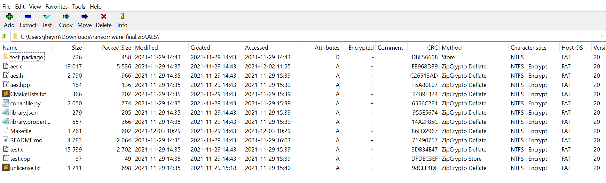

[Download Link for ZIP file](https://metaproblems.com/f807f1b6beeecc351ab76d1353e403e8/ransomware-final.zip)

# Background
When I first saw this challenge I thought it would just be as simple as using zip2john and running rockyou against it. Boy was I wrong. I tried using John the Ripper and fcrackzip and they didn't seem to know how to handle the way 7zip encrypts files, as opposed to using winzip or pkzip. As the challenge mentions, the zip archive was made in 7zip. So I opened the archive in 7zip to try to see if there was any useful information about how the archive was created. 

It looks like the encryption method used is called "ZipCrypto Store." A google search of the term results in various articles stating that this is a legacy encryption method prone to known plaintext attacks. That is, if you know at least 12 bytes of data in any of the encrypted files, you can find the encryption keys within minutes. I needed to guess some plaintext that I know will be contained in the archive. Thankfully, we can see the names of all of the files in the archive and the file size before compression.

My first thought was to use the unlicense.txt as a plaintext, as it is a pretty common license that people just copy word-for-word. But it didn't work for me. I also noticed that the file size of my unlicense.txt was different than that of the file size noted in the archive. So I went looking up some of the other files online and comparing file sizes. I found an aes.hpp that was the exact same file size (184 bytes) from a [Github repo.](https://github.com/kokke/tiny-AES-c/blob/master/aes.hpp) That didn't seem to work for me either. I must not have been setting it up right. 

After a day of doing other challenges, I wanted to give this another go because I knew it was close. I didn't realize it before, but that github repo with the .hpp file was an exact match to the contents in the ransomware archive (shoutout to Isaac). The comp was about to end in 15 minutes so I had to be quick. 

# Solution

1. For bkcrack, we need to make an unencrypted version of the plaintext using the same compression method used to make the encrypted archive. This information was given in the challenge "Made with 7ZIP deflate on normal settings." I downloaded and unzip the folder from the github repo containing the plaintext matches. https://github.com/kokke/tiny-AES-c
2. Now open the folder in 7zip and create the zip archive using deflate and normal settings. Leave password encryption blank, but notice how zipcrypto is actually the default 7ZIP encryption method? Funny, right?

4. I moved my new plaintext archive into Kali to use with bkcrack tool, which uses Biham and Kocher's known plaintext attack. There are a couple methods for this tool, but the one that worked for me was the one that uses two zip files. 
5. Move the two zip files into the bkcrack folder that contains the executable and execute this command:
`./bkcrack -C ransomware-final.zip -c AES/unlicense.txt -P tiny-AES-c-master.zip -p tiny-AES-c-master/unlicense.txt
` 

* `-C		encrypted archive`
* `-c cipher file (name of encrypted file in the encrypted archive)`
* `-P plaintext unencrypted archive we created using same compression method`
* `-p plaintext file in the archive we want to use`

Using 678 bytes of known plaintext takes less than a minute to crack. Once we have the keys, we can open other encrypted files.

5. `./bkcrack -C ransomware-final.zip -c key -k a71f05f4 18438c7b 1cf62c29 -d key.txt`
* `-C encrypted zip archive`
* `-c specified file within the encrypted archive that we want to use the key on to decrypt`
* `-k the keys we got from the last step (replace mine with yours)`
* `-d the name of file you want to put the decrypted data into`

6. See what's in the decypted file key.txt
  
  
It works!!!

Thanks for reading - Justin

## References
[Why you should never use zipcrypto](https://blog.devolutions.net/2020/08/why-you-should-never-use-zipcrypto/)

[Kai Anter - How to do a ZipCrypto plaintext attack](https://anter.dev/posts/plaintext-attack-zipcrypto/)

https://github.com/kimci86/bkcrack/blob/master/readme.md

https://superuser.com/a/859930

